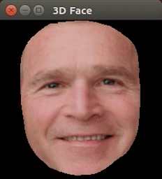

# FaceDemo: a simple 3D face alignment and warping demo
Input: face image/video  


Output: Textured 3D face model  




## Overview
This is the author's implementation of 3D face alignment and warping method described in:  
[Mirror Mirror: Crowdsourcing Better Portraits](http://www.eecs.berkeley.edu/~junyanz/projects/mirrormirror/)  
[Jun-Yan Zhu](https://people.eecs.berkeley.edu/~junyanz/), [Aseem Agarwala](http://www.agarwala.org/), [Alexei A. Efros](https://people.eecs.berkeley.edu/~efros/), [Eli Shechtman](https://research.adobe.com/person/eli-shechtman/), [Jue Wang](http://www.juew.org/)  
In ACM Transactions on Graphics (Proceedings of SIGGRAPH Asia 2014)  

Please cite our paper if you use our code for your research.

Given an image or a video sequence that contains a face, the program can align and warp the face to a 3D face model. The user can further rotate/translate the face, and adjust the camera projection (perspective projection or orthogonal projection). The program also provides different OpenGL rendering options. See **"Usage"** for details.

Contact: Jun-Yan Zhu (junyanz@berkeley.edu)
## Requirements
* OpenCV:
```bash
sudo apt-get install libopencv-dev
```
* OpenGL and GLUT:
```bash
sudo apt-get install libglu1-mesa-dev freeglut3-dev mesa-common-dev
sudo apt-get install libxmu-dev libxi-dev
```
* CLM Tracker by Jason Saragih (included)

## Getting Started (Linux)
* Download and unzip the code.

* Run the following command.
```bash
mkdir cbuild
cd cbuild
cmake -DCMAKE_BUILD_TYPE=Release  ../
make
```


## Usage
1. Command line interface: `./FaceDemo mode filePath`  
   - Example (image): `./FaceDemo image ./data/bush.jpg`  
   - Example (video): `./FaceDemo video ./data/eli.avi`  
2. The program displays three windows:
  - The "Detected Points" window shows the original input frame with the detected feature points.
   - The "3D Face" window shows a 3D face model rendered by OpenGL.
   - The "Projected Face" window shows a 2D projection result of the 3D face model. The program projects the 3D face back to the original image.
3. User Interaction: "3D Face" window takes the user's keyboard input.
   - shift + arrow keys: translate the face.
   - arrow keys: rotate the face.
   - `+/-`: zoom in/out
   - `p`:  toggle between perspective projection and orthogonal projection.
   - `s`:  toggle between flat and smooth shading.
   - `w`:  toggle between filled and wireframe mode.
   - `t`:  toggle between static mode and transformation mode: for static mode, the 3D face model doesn't rotate and translate.
   - `q`:  quit the program
